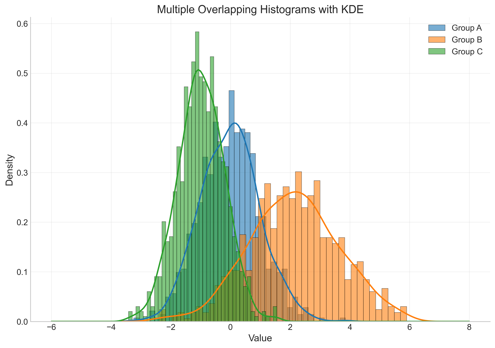

# Scientific Plotting Suite (科学绘图套件)

A comprehensive Python-based scientific plotting suite based on the "科学绘图共享计划" (Scientific Plotting Sharing Plan) PDF requirements. This project generates various types of scientific visualizations with consistent styling and organization.

## 📊 Chart Types Included

This suite implements 6 major categories of scientific plots:

### 1. Line Charts (折线图)


- **Basic Line Chart**: Simple time series data
- **Multiple Line Chart**: Comparing multiple datasets
- **Styled Line Chart**: Enhanced styling with markers
- **Subplots Line Chart**: Multiple related plots
- **Error Bar Line Chart**: Data with uncertainty

### 2. Bar Charts (柱状图)


- **Basic Bar Chart**: Simple categorical data
- **Grouped Bar Chart**: Comparing multiple categories
- **Stacked Bar Chart**: Cumulative data visualization
- **Horizontal Bar Chart**: Alternative orientation
- **Statistical Bar Chart**: With error bars and significance

### 3. Scatter Plots (散点图)


- **Basic Scatter Plot**: Simple correlation analysis
- **Colored Scatter Plot**: Third variable visualization
- **Sized Scatter Plot**: Bubble chart style
- **Categorical Scatter Plot**: Group-based analysis
- **Correlation Matrix**: Multiple variable relationships

### 4. Box Plots (箱线图)


- **Basic Box Plot**: Distribution comparison
- **Violin Plot**: Density distribution
- **Grouped Box Plot**: Multi-factor analysis
- **Notched Box Plot**: Statistical significance
- **Horizontal Box Plot**: Alternative layout

### 5. Histograms (直方图)





- **Basic Histogram**: Single distribution
- **Multiple Histograms**: Overlapping distributions
- **Stacked Histogram**: Categorical breakdown
- **2D Histogram**: Bivariate distribution
- **Distribution Comparison**: Statistical overlays

### 6. 3D Plots (三维图)


- **3D Surface Plot**: Mathematical functions
- **3D Scatter Plot**: Three-dimensional data
- **3D Wireframe**: Mesh visualization
- **3D Bar Plot**: Categorical 3D data
- **3D Contour Plot**: Level curves
- **Parametric 3D Plot**: Mathematical curves

## 🏗️ Project Structure

```
scientific_plotting/
├── utils/                          # Common utilities
│   ├── common_utils.py             # Shared functions and styling
│   └── __init__.py
├── line_chart/                     # Line chart implementations
│   ├── data/                       # Generated CSV data files
│   ├── plot/                       # Generated PNG plot files
│   └── code/
│       └── line_chart.py           # Line chart functions
├── bar_chart/                      # Bar chart implementations
│   ├── data/
│   ├── plot/
│   └── code/
│       └── bar_chart.py            # Bar chart functions
├── scatter_plot/                   # Scatter plot implementations
│   ├── data/
│   ├── plot/
│   └── code/
│       └── scatter_plot.py         # Scatter plot functions
├── box_plot/                       # Box plot implementations
│   ├── data/
│   ├── plot/
│   └── code/
│       └── box_plot.py             # Box plot functions
├── histogram/                      # Histogram implementations
│   ├── data/
│   ├── plot/
│   └── code/
│       └── histogram.py            # Histogram functions
├── 3d_plot/                        # 3D plot implementations
│   ├── data/
│   ├── plot/
│   └── code/
│       └── 3d_plot.py              # 3D plot functions
├── requirements.txt                # Python dependencies
├── run_all_plots.py               # Main execution script
└── README.md                      # This file
```

## 🚀 Quick Start

### Prerequisites

- Python 3.7 or higher
- pip package manager

### Installation

1. **Clone or download this project**
2. **Install dependencies:**
   ```bash
   cd scientific_plotting
   pip install -r requirements.txt
   ```

### Usage

#### Option 1: Run All Plots (Recommended)
```bash
python run_all_plots.py
```
This will generate all chart types automatically and provide a summary report.

#### Option 2: Run Individual Chart Types
```bash
# Line charts
cd line_chart/code && python line_chart.py

# Bar charts  
cd bar_chart/code && python bar_chart.py

# Scatter plots
cd scatter_plot/code && python scatter_plot.py

# Box plots
cd box_plot/code && python box_plot.py

# Histograms
cd histogram/code && python histogram.py

# 3D plots
cd 3d_plot/code && python 3d_plot.py
```

## 📦 Dependencies

- **numpy**: Numerical computing
- **pandas**: Data manipulation and analysis
- **matplotlib**: Core plotting library
- **seaborn**: Statistical data visualization
- **scipy**: Scientific computing

## 🎨 Features

### Consistent Styling
- Scientific publication-ready plots
- Consistent color palettes across all chart types
- Professional typography and layout
- High-resolution output (300 DPI)

### Data Generation
- Realistic synthetic datasets for each plot type
- CSV export for all generated data
- Reproducible random seeds for consistency

### Modular Design
- Each chart type is self-contained
- Shared utilities for common functionality
- Easy to extend with new chart types

### Error Handling
- Robust error handling and logging
- Graceful failure recovery
- Detailed progress reporting

## 📁 Output Files

After running the scripts, you'll find:

### Data Files (CSV format)
- `*/data/*.csv` - All generated datasets
- Includes headers and proper formatting
- Can be imported into other analysis tools

### Plot Files (PNG format)
- `*/plot/*.png` - High-resolution plot images
- 300 DPI for publication quality
- Consistent sizing and formatting

## 🔧 Customization

### Modifying Plots
Each plotting script can be customized by editing the respective Python files:
- Adjust data generation parameters
- Modify styling and colors
- Change plot dimensions and DPI
- Add new plot variants

### Adding New Chart Types
1. Create a new folder following the existing structure
2. Add data/, plot/, and code/ subfolders
3. Implement plotting functions using the common utilities
4. Update `run_all_plots.py` to include the new module

### Styling Customization
Edit `utils/common_utils.py` to modify:
- Color palettes
- Font settings
- Plot dimensions
- Scientific styling parameters

## 📊 Example Output

Each chart type generates multiple variants:

- **Line Charts**: 5 different styles (basic, multiple, styled, subplots, error bars)
- **Bar Charts**: 5 different styles (basic, grouped, stacked, horizontal, statistical)
- **Scatter Plots**: 5 different styles (basic, colored, sized, categorical, correlation)
- **Box Plots**: 5 different styles (basic, violin, grouped, notched, horizontal)
- **Histograms**: 5 different styles (basic, multiple, stacked, 2D, comparison)
- **3D Plots**: 6 different styles (surface, scatter, wireframe, bar, contour, parametric)

**Total**: 30+ individual plots with corresponding datasets

### Sample Output Gallery

Here are some examples of the generated plots:

<table>
<tr>
<td align="center">

<br><b>Multiple Line Chart</b>
</td>
<td align="center">

<br><b>Bubble Chart</b>
</td>
</tr>
<tr>
<td align="center">

<br><b>Violin Plot</b>
</td>
<td align="center">

<br><b>3D Surface Plot</b>
</td>
</tr>
</table>

## 🤝 Contributing

This project is based on the "科学绘图共享计划" (Scientific Plotting Sharing Plan). Contributions are welcome:

1. Add new chart types or variants
2. Improve existing implementations
3. Enhance documentation
4. Report bugs or suggest improvements

## 📄 License

This project is created for educational and research purposes based on the scientific plotting sharing plan.

## 🙏 Acknowledgments

- Based on the "科学绘图共享计划.pdf" requirements
- Inspired by best practices in scientific visualization
- Built with open-source Python libraries

---

**Happy Plotting! 🎨📊**

For questions or issues, please refer to the individual code files or the PDF documentation that inspired this project. 